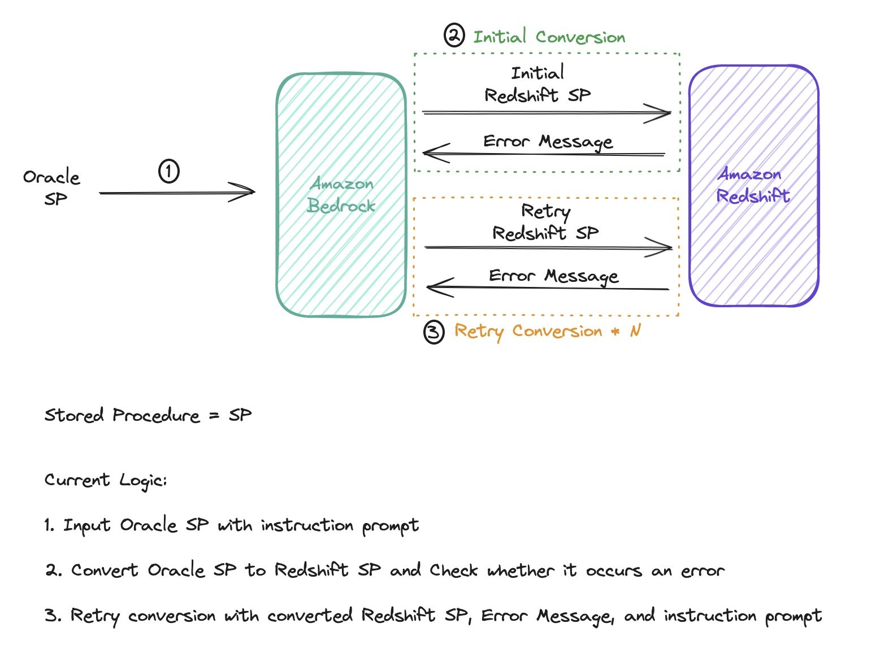

## Stored Procedure Conversion Tool from Oracle to Amazon Redshift
1. Introduction
2. Solution Overview
3. How to Run
4. Reference
</br>

## Introduction
This repository provides a deployable Stored Procedure(SP) Conversion Tool from Oracle to Redshift, leverating the power of Large Language Models(LLMs) backed by Amazon Bedrock.

If you are looking for a stored procedure(SP) conversion tool

Those who are looking for a stored procedure(SP) conversion tool that:
- Eliminate the need to directly connect to your Oracle source database
- Can convert stored procedure that cannot be handled by rule-based approaches

this repository offers a solution to get you started.

## Solution Overview
#### Problem
The traditional conversion tools like AWS Schema Conversion Tool(AWS SCT) support stored procedure conversion with rule-based approaches.
However, there are serveral huddles for customers to use AWS SCT:
- Install and configure AWS SCT to their machines
- Install JDBC Drivers to connect their source databases to AWS SCT
- Get a low conversion rate with rule-based approaches

With a goal to lift the above huddles, this repository offers a stored procedure conversion tool, leverating LLMs backed by Amazon Bedrock, suitable prompts for the conversion task, and retry logic.

#### Proposed Solution
<!--[Image] Architecture Diagram-->



## How to Run
#### Step 0. Prerequsites
Before moving to the next step, please ensure you have the following:
- AWS Account
- Access to at least one of the following Claude Models in Amazon Bedrock: 
    - Claude 3 Haiku
    - Claude 3 Sonnet
    - Claude 3 Opus
- IAM user or IAM role with permissions to deploy AWS CloudFormation Stacks
- Oracle stored procedures saved as text files


#### Step 1. Clone repository and install Python dependencies

Open your terminal, and run the following commands in the specified order:
```
git clone oracle-to-redshift-stored-procedure-converter-cdk-app

cd oracle-to-redshift-stored-procedure-converter-cdk-app

# [Mac Only] Create virtual environment
python -m venv .venv

# [Mac Only] Activate virtual environment
source .venv/bin/Activate

python -m pip install -r requirements.txt
```


#### Step 2. Set up the parameters
Open ```./cdk-app/app.py``` file and replace ```<admin_user>``` and ```<admin_user_password>``` that are used for authentications in Amazon Redshift.</br>
The ```<admin_user_password>``` must meet the following constraints:
- It must be 8 to 64 characters in length.
- It must contain at least one uppercase letter, one lowercase letter, and one number.
- It can use any ASCII characters with ASCII codes 33–126, except ' (single quotation mark), " (double quotation mark), \, /, or @.

```
redshift_admin_user = "<admin_user>"
redshift_admin_user_password = "<admin_user_password>"
```

#### Step 3. CDK Bootstrap
Set up the resources required by CDK to deploy into the AWS account. </br>
This step is only required if you have not used CDK in the deployment account and region. On your terminal, run the following command:
```
cdk bootstrap
```

#### Step 4. Deploy CDK Stacks
Synthesize and deploy CDK stacks to your AWS Account.

On your terminal, run the following commands in the specifed order:
```
# Sythesize CDK stacks into CloudFormation template
cdk synth --all

# Deploy CDK stacks
cdk deploy --all --require-approval never
```
If CDK stacks are successfully deployed, you can ses the messages like the below on your terminal.


#### Step 5. Open a notebook file in SageMaker notebook

Go to AWS Console and search <strong>SageMaker</strong>.</br>
On the left pane in Amazon SageMaker console, click <strong>Notebooks</strong> under Applications and IDEs and click <strong>Open jupyterLab</strong>.


#### Step 6. Run a notebook
Open ```main.ipynb``` file and run cells sequentially.</br>
Check for three Markdown blocks with red text that require your attention before you run a followed code cell.
.png)
.png)

## Reference
- [Build a robust text-to-SQL solution generating complex queries, self-correcting, and querying diverse data sources](https://aws.amazon.com/blogs/machine-learning/build-a-robust-text-to-sql-solution-generating-complex-queries-self-correcting-and-querying-diverse-data-sources/)
